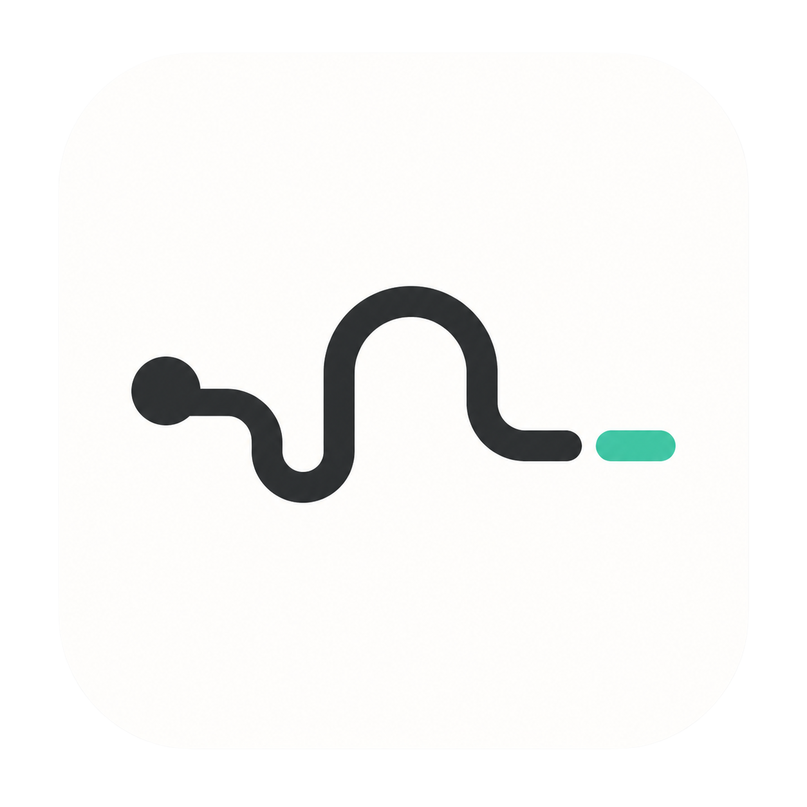

<p align="center">
  
</p>

# tetherly

Discord channel ↔ tmux session bridge.

> 📖 **Documentation is in [docs/](docs/) — split into [user docs](docs/user/) (setup, commands, troubleshooting) and [contributing docs](docs/contributing/) (internals).** This README is a quick start.

## Features

- `/bind session:<name>`: bind the current Discord channel to a tmux session
- `/config auto_send:<true|false>`: enable or disable plain-text auto-send for the current bound channel
- `/send text:<message>`: send text plus Enter into the bound tmux session
- `/key key:<Enter|Escape|Ctrl-C|Ctrl-D|Tab|Up|Down|Left|Right>`: send a special key into the bound tmux session
- `/tail lines:<n>`: fetch recent tmux output
- `/status`: inspect the current binding and tmux session status
- `tetherly discord-send --message <text>`: let an agent inside a bound tmux session send a reply back to Discord
- `tetherly codex-stop` / `tetherly codex-permission-request`: Codex hook handlers that forward messages to the bound Discord channel

## Requirements

- Python 3.11+
- `tmux` installed
- A Discord bot token (Message Content Intent enabled if you want plain-text auto-send)

## Setup

Install once on your machine:

```bash
pipx install tetherly
tetherly init
```

`tetherly init` is interactive. It writes `~/.tetherly/.env` and asks where to install Codex hooks:

- **Global** — writes `~/.codex/hooks.json` once. Hooks fire in every project automatically; nothing per-project.
- **Project** — skip global hooks and run `tetherly install-hooks` inside each project where you want them.
- **Skip** — don't touch Codex hooks.

Then start the bot:

```bash
tetherly
```

That's it. State lives at `~/.tetherly/state.json` so a single bot can serve every project.

### Per-project usage

For each project you want to drive from Discord:

```bash
tmux new -s <session-name>
# inside the bound channel on Discord:
#   /bind session:<session-name>
#   /config auto_send:true
```

If you chose **Project** mode during init, also run once per project:

```bash
cd <project>
tetherly install-hooks
```

`install-hooks` accepts `--global` to (re)install user-level hooks instead.

### Sending from inside a session

```bash
tetherly discord-send --message "작업 끝났습니다"
cat result.txt | tetherly discord-send --stdin
tetherly discord-send --session t1 --message "..."   # explicit session
```

## Configuration

`tetherly init` writes everything you need. Advanced overrides live in `~/.tetherly/.env` or shell env:

| Variable | Default | Notes |
| --- | --- | --- |
| `DISCORD_BOT_TOKEN` | (required) | Bot token |
| `TETHERLY_ALLOWED_USER_IDS` | (required) | Comma-separated user IDs |
| `TETHERLY_ALLOWED_GUILD_IDS` | — | Restrict commands to these guilds |
| `TETHERLY_ALLOWED_ROLE_IDS` | — | Allow members holding any of these roles |
| `TETHERLY_TEST_GUILD_ID` | — | Dev guild for instant slash-command sync |
| `TETHERLY_STATE_PATH` | `~/.tetherly/state.json` | Where bindings are persisted |
| `TETHERLY_DEFAULT_TAIL_LINES` | `40` | Default `/tail` line count |
| `TETHERLY_MAX_TAIL_LINES` | `200` | Cap for `/tail` |
| `TETHERLY_LOG_LEVEL` | `INFO` | Logger verbosity |

A `.env` in the current working directory still overrides `~/.tetherly/.env`.

## Codex hooks

Both hooks only fire when the active tmux session has `TETHERLY_NOTIFY_ON_FINISH=1` — `/bind` sets that flag automatically, so projects without a binding stay silent even when global hooks are installed.

- `Stop` → `tetherly codex-stop` forwards `last_assistant_message` to the bound channel.
- `PermissionRequest` → `tetherly codex-permission-request` forwards the tool/command/reason. It does not return an `allow`/`deny` decision, so Codex's normal approval prompt still appears.
